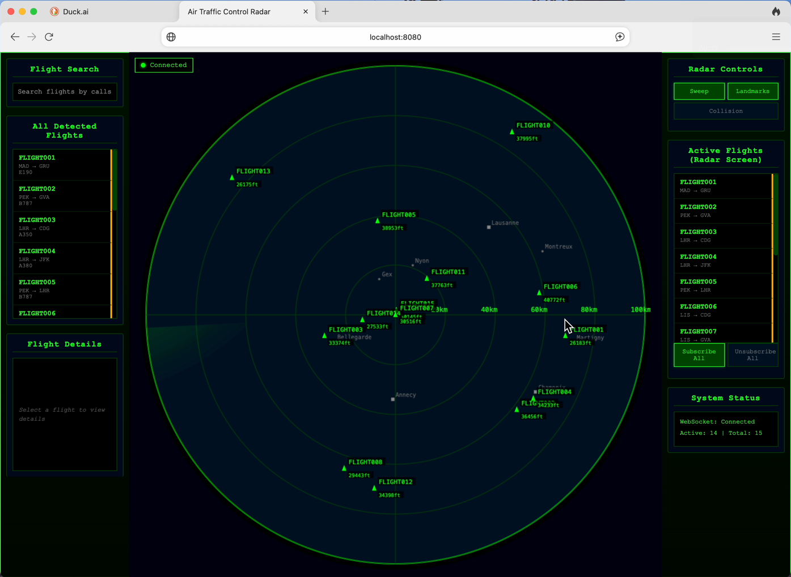

# Air Traffic Control

 <!-- Replace with the path to your image -->

## Overview

Welcome to **Air Traffic Control**! This is a Java backend application built using **Clean Architecture** principles, designed to provide a robust and maintainable codebase. The backend leverages **Spring Framework** for dependency injection and web services, while **RabbitMQ** is utilized for asynchronous messaging, ensuring efficient communication between services.

The frontend is developed using **jQuery** and **JavaScript**, with real-time communication facilitated by **WebSocket** through **Socket.IO**, providing a dynamic and responsive user interface that interacts seamlessly with the backend.

 <!-- Replace with the path to your image -->

## Features

- **Clean Architecture**: Promotes separation of concerns, making the codebase easier to manage and test.
- **Asynchronous Messaging**: Utilizes RabbitMQ for reliable message queuing and processing.
- **Real-Time Communication**: Implements WebSocket with Socket.IO for instant data exchange between the client and server.
- **Dynamic Frontend**: Built with jQuery and JavaScript for a smooth user experience.

## Technology Stack

- **Backend**:
    - Java
    - Spring Framework
    - RabbitMQ
    - WebSocket (Socket.IO)
- **Frontend**:
    - jQuery
    - JavaScript

## Getting Started

To get a local copy up and running, follow these steps:

1. **Clone the repository**:
   ```bash
   git clone https://github.com/btafarelo/air-traffic-control.git

2. **RabbitMQ**:
   ```Docker
   You can run rabbitmq like this: docker run --rm -ti -p 5672:5672 -p 15672:15672 rabbitmq:management